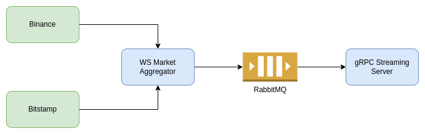

# Rust Market Aggregator

Simple orderbook aggregator that maintains a local orderbook fetched from different exchanges.

Currently supported exchanges are:
- Binance
- Bitstamp

## Architecture

- WS Market Aggregator - maintains websocket connection with each exchange, reconnects on stream errors and maintains a local orderbook from each exchange
- gRPC Streaming Server - consumes orders from the queue and server them on a gRPC stream

## Running

To run all the services inside Docker, just run the `docker-compose.yaml`:

`docker compose up -d`

## Consuming

The repo also contains an example client that subscribes to the gRCP stream. To run the example, make sure the services are running inside Docker and run:

`cargo run --bin client`

## License
MIT